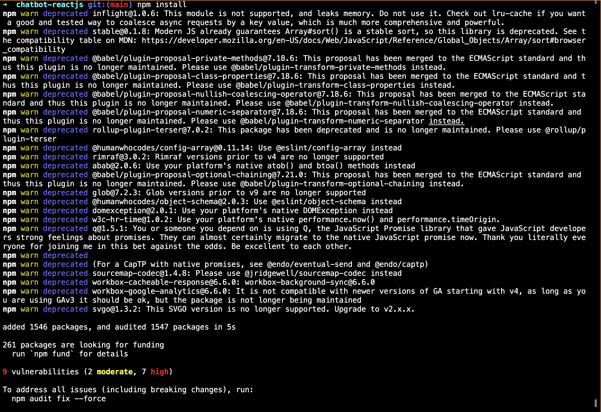

# Chatbot ReactJS

## Deskripsi
Ini adalah aplikasi front end chatbot yang dibangun dengan ReactJS. Aplikasi ini merupakan User Interface yang akan digunakan pengguna untuk berkomunikasi dengan sistem ChatBot. Aplikasi ini terintegrasi dengan backend Laravel yang berfungsi sebagai server API.

## Prasyarat
Sebelum Anda mulai, pastikan Anda telah menginstal perangkat lunak berikut di mesin Anda:

- **Node.js**
- **NPM** 
- **Git**

## Instalasi

### 1. Clone Repository
Pertama, clone repository ini ke direktori lokal Anda:

```bash
git clone https://github.com/VinsensiusF/chatbot-reactjs.git
cd chatbot-reactjs
```


### 2. Install Dependencies
Setelah repository di-clone, instal semua dependencies yang diperlukan dengan perintah berikut:

```bash
npm install
```


### 4. Menjalankan Aplikasi
Setelah semua dependencies terinstal, jalankan aplikasi dengan perintah berikut:

```bash
npm start
```


Aplikasi ini sekarang dapat diakses di :
```bash
http://localhost:3000.
```


[![Watch the video]](https://youtu.be/a9RGYtNnGa0)

